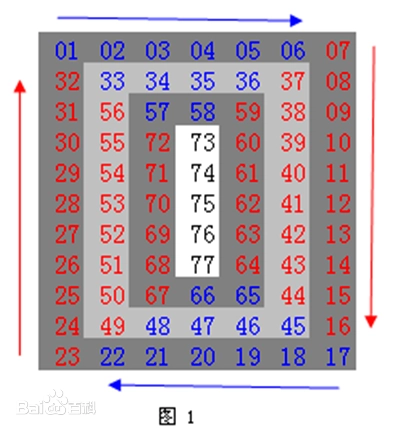

# 螺旋矩阵
1. 首先，通过键盘输入获取两个整数，分别记为`m`和 `n`，这两个整数将分别代表矩阵的行数和列数。
2. 接着，依据获取到的`m`和`n`的值，通过键盘逐行输入矩阵的元素，从而构建出一个$m\times n$的矩阵。矩阵中每个元素均为整数类型，且每行元素之间需以空格作为分隔符输入，每行输入完成后按下回车键确认输入下一行。
3. 从矩阵的左上角元素开始，按照顺时针方向依次输出矩阵中的每一个元素，最终将所有元素按照顺时针顺序输出显示在控制台上。
>若输入$m=3$,$n=3$，然后依次输入矩阵元素如下：
```
第一行：1 2 3
第二行：4 5 6
第三行：7 8 9
```
>则程序应按照顺时针顺序输出该矩阵的元素，输出结果应为：1 2 3 6 9 8 7 4 5
## 1首先读入$m$和$n$
```python
m,n = int(input().split(' '))
```
这里使用map,不然没有办法直接用int转换`['1', '2', '3'],`这是保存的字符串。
```python
m, n = map(int, input("请输入两个整数，以空格分隔: ").split(' '))
```
## 2读入矩阵
```python
matrix = [] # 先创建一个空列表
```
使用 `list()`，将 `map(int, **)`转换的整形，打包 `[1, 2, 3],`
```python
list(map(int,input(f"请输入第{i+1}行:").split(' ')))
```
>测试输入
```python
m, n = map(int, input("请输入两个整数，以空格分隔: ").split(' '))
arr = []
for i in range(m):
    arr_n = list(map(int,input(f"请输入第{i+1}行:").split(' ')))
    arr.append(arr_n)
print(arr)
```
运行结果：
```toml
请输入两个整数，以空格分隔: 3 3
请输入第1行:1 2 3
请输入第2行:4 5 6
请输入第3行:7 8 9
[[1, 2, 3], [4, 5, 6], [7, 8, 9]]
```

```python
N = n-1
M = m-1
re_arr = []
for i in range(N):
    re_arr.append(arr[0][i])
for j in range(M):
    re_arr.append(arr[j][N])
for i in range(N):
    re_arr.append(arr[M][N-i])
for j in range(M):
    re_arr.append(arr[M-j][0])
print(re_arr)
```
相当于是第一圈的，运行结果如下：
```toml
请输入两个整数，以空格分隔: 4 3
请输入第1行:1 2 3
请输入第2行:4 5 6
请输入第3行:7 8 9
请输入第4行:1 2 3
[1, 2, 3, 6, 9, 3, 2, 1, 7, 4]
```
## 3如何去读内圈？
>我没想到, ⭐⭐⭐这里<font color=red>**range()**</font>有高级用法
```python
# 从左到右打印
for j in range(left, right + 1):
# 从上到下打印
for i in range(top, bottom + 1):
# 从右到左打印
for j in range(right, left - 1, -1):
# 从下到上打印
for i in range(bottom, top - 1, -1):
```
没有想到**range**的这个高级用法😢😢😢
